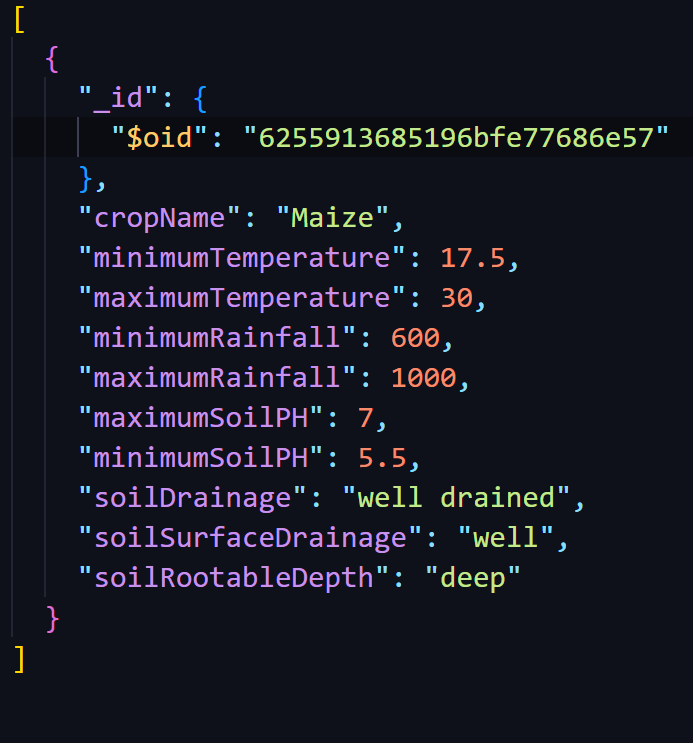

# Knowledge Base Connector

## The Knowledge Base
The knowledge base is collection of crop data i.e the requirements to grow a particular crop. 
These requirements are :

<ul>
    <li>Rainfall amount</li>
    <li>Temperature</li>
    <li>Soil requirements</li>
        <ol>
        <li>Soil PH</li>
        <li>Surface drainage</li>
        <li>Rootable depth</li>
        <li>Soil drainage</li>
        </ol>
        
</ul>
   

The knowledge base is a MongoDB collection 
(Planning to push it to github in the future) 

The crops currently in the knowledge base are: 

    1. Maize
    2. Beans
    3. French Beans
    4. Cabbage
    5. Bananas
    6. Green Grams
    7. Avocados
    8. Carrots
    9. Onions
    10. Peas
    11. Spinach

## The Backend
The data from the MongoDB collection is fetched using NodeJS/Express. 

The backend is an API that serves the data at the endpoint : 
`http://localhost:5000/crops/${cropName}`, 
where`${cropName}` is a placeholder for the crop whose requirements you wish to fetch. 

## Sample
Using Maize as an example,data is stored in the knowledge base as follows: 
(In case you wish to implement a crop knowledge base of your own) 

## Additional Information
Check out the [Agricultural Decision Maker API](https://github.com/gabrielwere/agricultural-decision-maker-api) and the [GIS UI](https://github.com/gabrielwere/gis-ui) repositories to see the crop knowledge base in use. 

